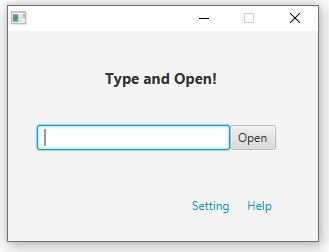
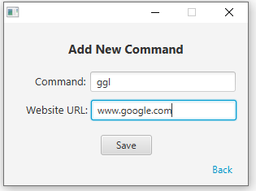
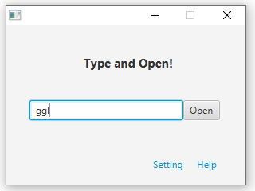
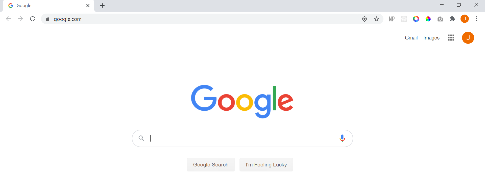

# Fast Opener

This program provides user-defined shortcut commands to visit frequently visited websites.

## Tools Used
This program is developed using Java and JavaFX. 

## Main page

When you run the program, you will see the main page.
From the main page, you can go to 'Setting' menu to create new commands or view existing commands.

## Adding commands

In the 'Add New Command' menu, you can map a new command with a website URL.
For example, you can add a new command 'ggl' to map with www.google.com

## Running commands to open a website

You can type the added command on the main page and click 'Open".
The program will open up the website you saved.
For example, typing 'ggl' will open 'www.google.com'

